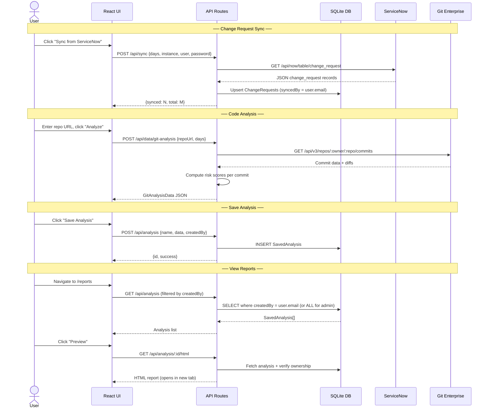
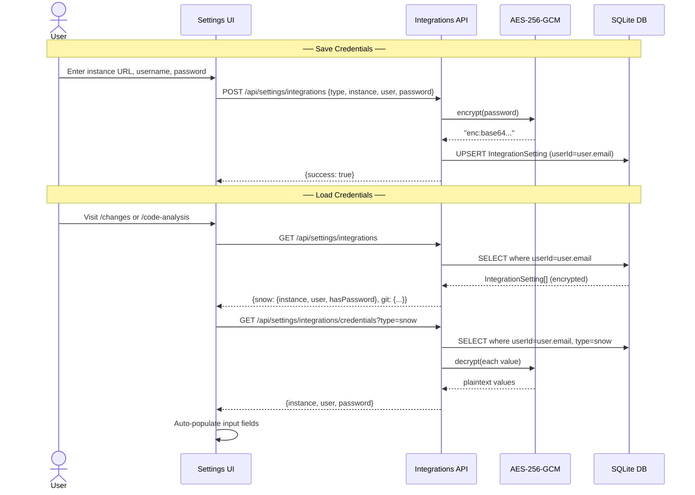
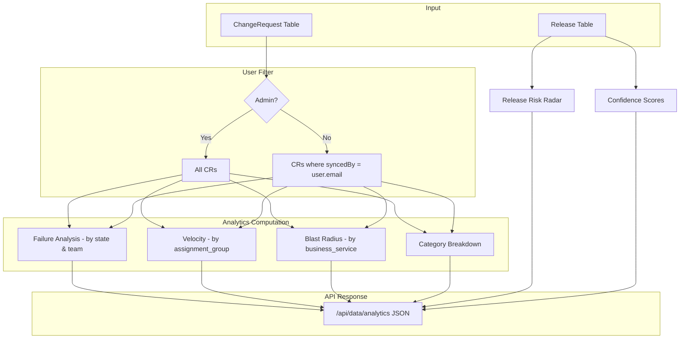

# Data Flow

How data moves through the system from external sources to the UI.

## Sync & Analysis Pipeline

```mermaid
sequenceDiagram
    actor User
    participant UI as React UI
    participant API as API Routes
    participant DB as SQLite DB
    participant SNOW as ServiceNow
    participant GIT as Git Enterprise

    Note over User,GIT: ── Change Request Sync ──
    User->>UI: Click "Sync from ServiceNow"
    UI->>API: POST /api/sync {days, instance, user, password}
    API->>SNOW: GET /api/now/table/change_request
    SNOW-->>API: JSON change_request records
    API->>DB: Upsert ChangeRequests (syncedBy = user.email)
    API-->>UI: {synced: N, total: M}

    Note over User,GIT: ── Code Analysis ──
    User->>UI: Enter repo URL, click "Analyze"
    UI->>API: POST /api/data/git-analysis {repoUrl, days}
    API->>GIT: GET /api/v3/repos/:owner/:repo/commits
    GIT-->>API: Commit data + diffs
    API->>API: Compute risk scores per commit
    API-->>UI: GitAnalysisData JSON

    Note over User,GIT: ── Save Analysis ──
    User->>UI: Click "Save Analysis"
    UI->>API: POST /api/analysis {name, data, createdBy}
    API->>DB: INSERT SavedAnalysis
    API-->>UI: {id, success}

    Note over User,GIT: ── View Reports ──
    User->>UI: Navigate to /reports
    UI->>API: GET /api/analysis (filtered by createdBy)
    API->>DB: SELECT where createdBy = user.email (or ALL for admin)
    DB-->>API: SavedAnalysis[]
    API-->>UI: Analysis list
    User->>UI: Click "Preview"
    UI->>API: GET /api/analysis/:id/html
    API->>DB: Fetch analysis + verify ownership
    API-->>UI: HTML report (opens in new tab)
```

## Credential Flow

```mermaid
sequenceDiagram
    actor User
    participant UI as Settings UI
    participant API as Integrations API
    participant Crypto as AES-256-GCM
    participant DB as SQLite DB

    Note over User,DB: ── Save Credentials ──
    User->>UI: Enter instance URL, username, password
    UI->>API: POST /api/settings/integrations {type, instance, user, password}
    API->>Crypto: encrypt(password)
    Crypto-->>API: "enc:base64..."
    API->>DB: UPSERT IntegrationSetting (userId=user.email)
    API-->>UI: {success: true}

    Note over User,DB: ── Load Credentials ──
    User->>UI: Visit /changes or /code-analysis
    UI->>API: GET /api/settings/integrations
    API->>DB: SELECT where userId=user.email
    DB-->>API: IntegrationSetting[] (encrypted)
    API-->>UI: {snow: {instance, user, hasPassword}, git: {...}}
    UI->>API: GET /api/settings/integrations/credentials?type=snow
    API->>DB: SELECT where userId=user.email, type=snow
    API->>Crypto: decrypt(each value)
    Crypto-->>API: plaintext values
    API-->>UI: {instance, user, password}
    UI->>UI: Auto-populate input fields
```

## Analytics Data Flow

```mermaid
flowchart TD
    subgraph Input
        CR[ChangeRequest Table]
        REL[Release Table]
    end

    subgraph "User Filter"
        F{Admin?}
        F -->|Yes| ALL[All CRs]
        F -->|No| OWN["CRs where syncedBy = user.email"]
    end

    CR --> F

    subgraph Compute["Analytics Computation"]
        FA[Failure Analysis - by state & team]
        VEL[Velocity - by assignment_group]
        BR[Blast Radius - by business_service]
        CAT[Category Breakdown]
    end

    ALL --> FA & VEL & BR & CAT
    OWN --> FA & VEL & BR & CAT
    REL --> RR[Release Risk Radar] & CS[Confidence Scores]

    subgraph Output["API Response"]
        JSON["/api/data/analytics JSON"]
    end

    FA & VEL & BR & CAT & RR & CS --> JSON
```
